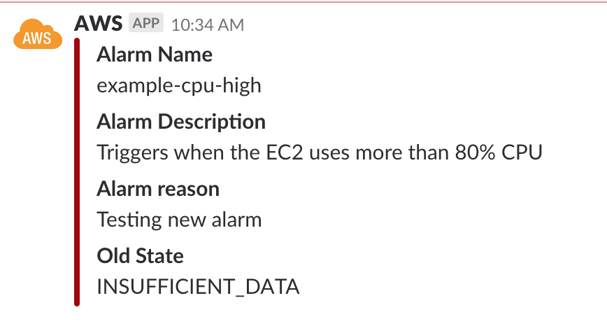

# aws-slack-notification
Trigger an alarm to invoke a Lambda function written in Go that calls the Slack API to post a message to your channel

## Usage

1. Write Lambda function `main.go`
1. Install dependencies
    ```
     go get github.com/aws/aws-lambda-go
    ```
1. Build binary file and zip it in `deployment.zip`
    ```
    ./build.sh
    ```
1. Deploy the function to Lambda:
Using [terraform](https://www.terraform.io/) in `terraform`
* Edit your infrastructure (I only use 1 ec2 instance there as an example)
* Edit `terraform.tfvars` with your corresponding values
    ```
    aws_profile = "money"
    slack_webhook = "https://hooks.slack.com/services/TOKEN"
    ```
    * `aws_profile` is account in `~/.aws/credentials` 
* Apply
    ```
    terraform init
    terraform apply
    ```

## Test

Can use AWS cli to fake an alarm
```
aws cloudwatch set-alarm-state --alarm-name example-cpu-high --state-value ALARM --state-reason "Testing new alarm"
```
## Result


